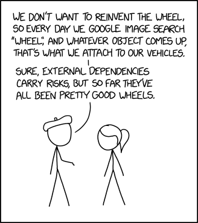

# OWASP Dependency Check
## A Primer

---

### The Problem




#### In A Nutshell

1. Modern applications depend on open source, 
2. they contain many 3rd party components **and their vulnerabilities**.

_"Reinvent The Wheel"_ by xkcd: https://xkcd.com/2140/

---

### The Problem


This problem has been recognized by the OWASP Top 10 Web Application Security Risks.

#### OWASP Top 10
> _"**#9 Using Components with Known Vulnerabilities.** Components, such as libraries, frameworks, and other software modules, run with the same privileges as the application. If a vulnerable component is exploited, such an attack can facilitate serious data loss or server takeover. Applications and APIs using components with known vulnerabilities may undermine application defenses and enable various attacks and impacts."_ [[owasp.org](https://owasp.org/www-project-top-ten/)]

For more Information see: [Using_Components_with_Known_Vulnerabilities](
https://owasp.org/www-project-top-ten/OWASP_Top_Ten_2017/Top_10-2017_A9-Using_Components_with_Known_Vulnerabilities)

---

### Enter _OWASP Dependency Check_


A tool for mitigating OWASP Top 10 #9.

Checks dependencies for **Known Vulnerabilities**.

Developed by OWASP / Jeremy Long.

Full support for Java and .NET applications.

Experimental support for Python, Ruby, PHP and JavaScript/Node.js applications.

References:
* [Project site on owasp.org](https://owasp.org/www-project-dependency-check/)
* [Online documentation on github.io](https://jeremylong.github.io/DependencyCheck/)

---

### Azure Pipeline Integration
#### Hosted Agents


Just add this tasks to your pipeline.
```yml
- task: dependency-check-build-task@5
  displayName: 'Dependency Check: Run'
  inputs:
    projectName: MyProject       # name of the project
    scanPath: path/to/scanPath   # path of artifacts to scan
    failOnCVSS: 0                # threshold when to fail build
    format: 'HTML'               # output format
    enableExperimental: false    # use experimental analyzers
    enableRetired: false         # use retired analyzers
    enableVerbose: false         # run in verbose mode
```

---

### Azure Pipeline Integration
#### On-Premise Agents (1/2)


Dependency-Check requires JRE/JDK to run.
```yml
- task: JavaToolInstaller@0
  displayName: 'Dependency Check: Install OpenJDK'
  inputs:
    versionSpec: "13"
    jdkArchitectureOption: x64
    jdkSourceOption: LocalDirectory
    jdkFile: "path/to/openjdk-13.0.2_windows-x64_bin.zip"
    jdkDestinationDirectory: "DependencyCheck/Binaries/Externals"
    cleanDestinationDirectory: true

- task: dependency-check-build-task@5
  ...
```


---

### Azure Pipeline Integration
#### On-Premise Agents (2/2)


.NET Analyzers require .NET Core.
```yml
- task: UseDotNet@2
  displayName: 'Dependency Check: Install .NET Core sdk'
  inputs:
    packageType: sdk
    version: 2.x
    installationPath: $(Agent.ToolsDirectory)/dotnet

- task: JavaToolInstaller@0
  ...

- task: dependency-check-build-task@5
  ...
```

---


<style scoped>
li {
  font-size: 28px
}
</style>

### Common Vulnerabilities and Exposures


Project Site: https://cve.mitre.org/

A system to identify publicly known vulnerabilities and exposures.

* **CVE Number**
identifies publicly known vulnerabilities and exposures
* **CVE Numbering Authority (CNA)**
assigns CVE Numbers
e.g. The MITRE Corporation, Microsoft, Red Hat and [others](https://cve.mitre.org/cve/cna.html)
* **CVE Number Syntax**
`CVE prefix + Year + Arbitrary Digits`
e.g. [CVE-2020-11022](https://nvd.nist.gov/vuln/detail/CVE-2020-11022)


---

<style scoped>
li {
  font-size: 25px
}
</style>

### Common Vulnerabilities and Exposures


CVE Numbers are only assigned to flaws which satisfy the following criteria.

A flaw must be:
1. **Independently Fixable**
The flaw can be fixed independently of any other bugs.
2. **Acknowledged by the affected vendor** or **Documented**
The flaw is either confirmed by the vendor or has a recorded prove.
3. **Affecting one codebase**
The flaw may impact many products, e.g white-labeling, but resides in a single codebase.

For further information see: https://www.redhat.com/en/topics/security/what-is-cve

---

<style scoped>
li {
  font-size: 25px
}
</style>

### Common Weakness Enumeration


Project Site: https://cwe.mitre.org/

A category system for software weaknesses and vulnerabilities.

The CWE system is a community project which aims to understand, identify, fix and prevent common security flaws in software and to create automated tools helping with these objectives.

* **CWE Number**
identifies a category of known weaknesses or a concrete known weakness in software
* **CWE Number Syntax**
`CWE prefix + Arbitrary Digits`
e.g.:
  * _Category:_ [CWE-1211](https://cwe.mitre.org/data/definitions/1211.html) Authentication Errors
  * _Weakness:_ [CWE-295](https://cwe.mitre.org/data/definitions/295.html) Imporper Certificate Validation

---

<style scoped>
li {
  font-size: 25px
}
li li {
  font-size: 15px
}
</style>

### The MITRE Corporation


The CVE and CWE systems are maintained and sponsored by [The MITRE Corporation](https://en.wikipedia.org/wiki/Mitre_Corporation).
* Non-Profit Organization
* Primary CNA
* Funded by various US Government institutions:
  * Dpt. of Homeland Security
  * Dpt. of Defense
  * Federal Aviation Administration
  * Internal Revenue Service 
  * Department of Veterans Affairs. 
  * National Institute of Standards and Technology
  * Administrative Office of the United States Courts
  * Centers for Medicare and Medicaid Services

**FYI:** "MITRE" has no meaning, although it originated around the  Massachusetts Institute of Technology (MIT)


---

### Common Vulnerability Scoring System 


---

### Common Platform Enumeration


---

### How It Works

---

### Reading Reports

---

### False Positives


```yml
- task: dependency-check-build-task@5
  displayName: 'Dependency Check: Run'
  inputs:
    ...
    suppressionPath: 'path/to/DependencyCheck/Supressions.xml' # add a supression file
    ...
```

```xml
<?xml version="1.0" encoding="UTF-8"?>
<suppressions xmlns="https://jeremylong.github.io/DependencyCheck/dependency-suppression.1.3.xsd">
    <suppress until="2020-01-01Z">
      <notes><![CDATA[
      file name: some.jar
      ]]></notes>
      <sha1>66734244CE86857018B023A8C56AE0635C56B6A1</sha1>
      <cpe>cpe:/a:apache:struts:2.0.0</cpe>
    </suppress>
</suppressions>
```

For further information see: [Suppressing False Positives](https://jeremylong.github.io/DependencyCheck/general/suppression.html)

---

### False Negatives

```yml
- task: dependency-check-build-task@5
  displayName: 'Dependency Check: Run'
  inputs:
    ...
    additionalArguments: '--hints "$(Build.SourcesDirectory)/path/to/DependencyCheck/Hints.xml"' # add a hints file
    ...
```

```xml
<?xml version="1.0" encoding="UTF-8"?>
<hints xmlns="https://jeremylong.github.io/DependencyCheck/dependency-hint.1.1.xsd">
    <hint>
        <given>
            <fileName contains="my-thelib-.*\.jar" regex="true" caseSensitive="true"/>
        </given>
        <add>
            <evidence type="product" source="hint analyzer" name="product" value="thelib" confidence="HIGH"/>
        </add>
  </hint>
</hints>
```

For further information see: [Resolving False Negatives](https://jeremylong.github.io/DependencyCheck/general/hints.html)

---

# Thanks!
